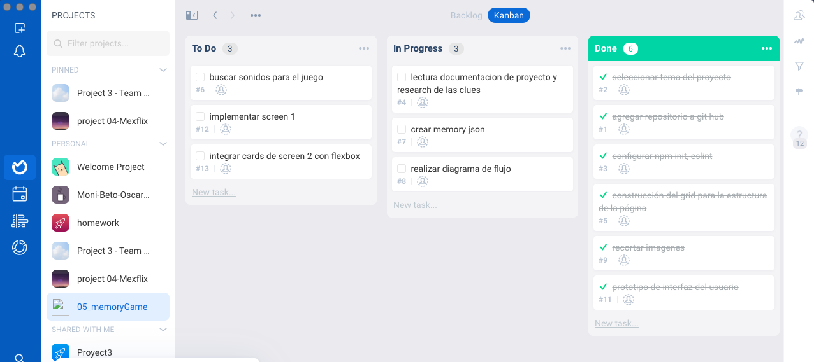
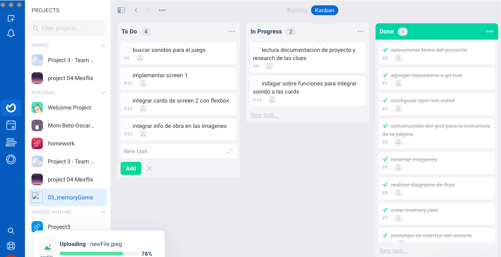
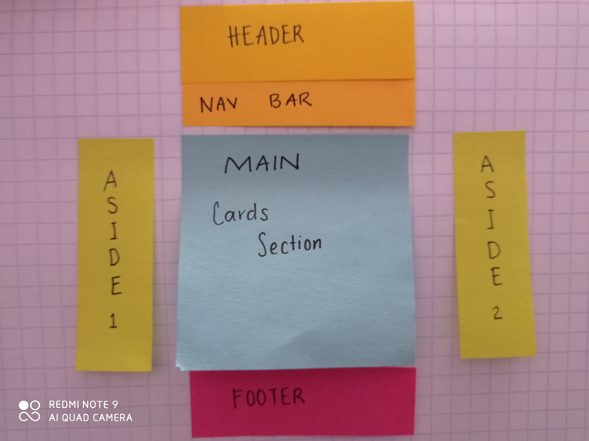
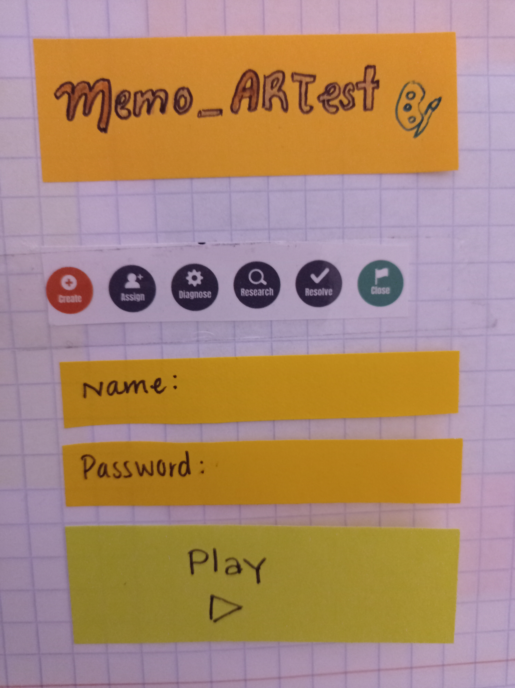
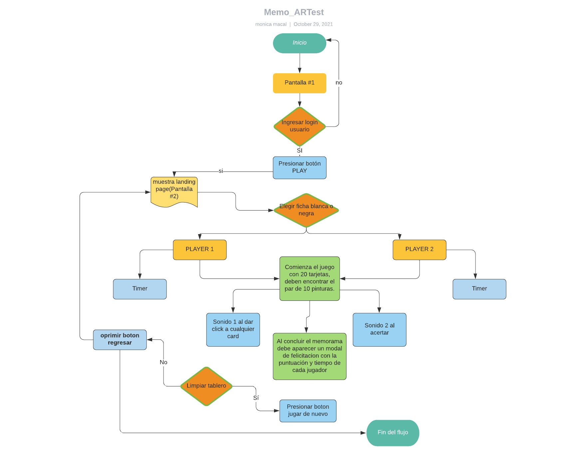
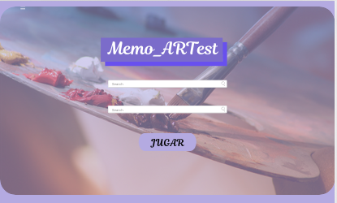
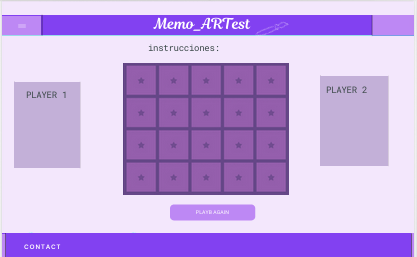

# **05_Project_memoryGame**

Índice

    1. Descripción
    2. Definición de Usuario e Historias de usuario (UX)
    3. Requerimientos técnicos
    4. Pseudocódigo
    5. Copyright

---

### 1. _Descripción_

Página que permite jugar con otro competidor y probar sus conocimientos en historia del arte.

-El juego debe saber cómo manejar cartas combinadas e inigualables.

-El juego debe mostrar el número actual de movimientos que ha realizado un usuario.

-El juego debe mostrar el timer de cada partida.

Debe aparecer un modal de felicitaciones cuando el jugador gana, asi como un sonido de fondo, mientras se muestra un botón para jugar de nuevo y el modal debe mostrar: cuánto tiempo tomó y calificación que obtuvó.

### 2. _Historia de usuario_

\*Omar es un profesor de preparatoria y requiere evaluar los conocimientos de sus alumnos en historia del arte, realizó una prueba sobre que tipo de aprendizaje predominaba en su clase(Visual,auditivo ó kinestésico).
La mayoria de sus alumnos presento un estilo visual de aprendizaje y necesita una estrategia para enseñar los temas pendientes del semestre.

\*El memo_ARTest, le permitirá a Omar enseñar a sus alumnos de manera visual y dinámica pinturas de distintas corrientes artísticas.

- Al finalizar la partida se dará la opción de reiniciar el juego.

## _Proceso de flujo de trabajo_

Se utiliza el método agile para distribuir las tareas del proyecto

---

## 3. _UI(user interface)_

### Maquetación

---

## _Diagrama de flujo_

---

## 4.Pseudocódigo 📋

#### CopyRight

© Copyright 2021-Proyecto#5 Memory_Game by Monica Macal
